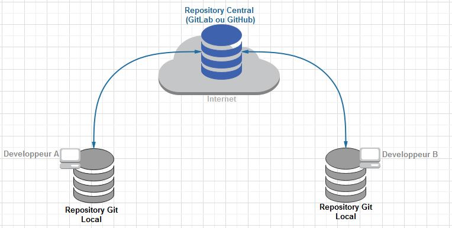

## Développeur Web PHP

Projet de démo : https://github.com/maxhelias/get-started-blog

### Symfony

Symfony est un ensemble réutilisable de composants PHP autonomes, découplés qui résolvent les problèmes de développement Web courants.

Les composants peuvent être utilisé à bas niveau ou vous pouvez utiliser le framework Web complet Symfony prêt à l'emploi, qui est basé sur ces composants.

De nombreux frameworks Web modernes se présentent comme étant des modèles MVC (model - view - controller). 

 - Model : Base de donnée
 - View : Templating de rendu
 - Controller : Logique métier

### Gestion des dépendances

Pour installer le framework Symfony ou les composants Symfony dont vous avez besoin, nous allons utiliser [Composer](https://getcomposer.org/), un gestionnaire de dépendances de projet pour PHP.

### Contrôle de version

Pour gérer un projet efficacement dans la durée, nous utilisons un logiciel de contrôle de version permettant de gérer un ou des fichiers qui évoluent avec le temps.
Il permet de retracer l'origine de chaque modification, de rétablir des versions précédentes et permet l'intégration de modifications effectuées en parallèle.

Exemple : GIT sont des gestionnaires de versions décentralisé, c'est à dire qu'il fonctionne avec 2 niveaux de dépôts : un remote et local.

