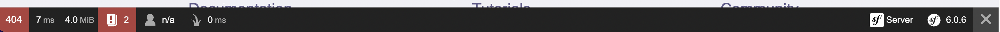

## Debug

### Console

La console de Symfony est un outil très puissant pour debug son code.

```bash
php bin/consoles
```

Vous pouvez voir la liste des commandes qui vont vous permettre d'avoir toutes les informations pour debug, générer du code, mettre à jour la base de donnée et bien d'autre. Plus vous installerez de bundle, plus vous aurez de nouvelle commande.

Pour voir la liste des routes disponible de votre application, utilisez :

```bash
php bin/console debug:router

```

Vous devriez voir votre nouvelle route `app_blog` dans la liste.

### Web Debug Toolbar



Si vous retournez un contenu HTML via votre controller, Symfony vous rajoutera ce bandeau en base de votre application avec toutes les informations de votre application.
Pareil que pour la console, plus vous installeez de nouveau bundle, plus vous aurez d'information sur la debug toolbar.
